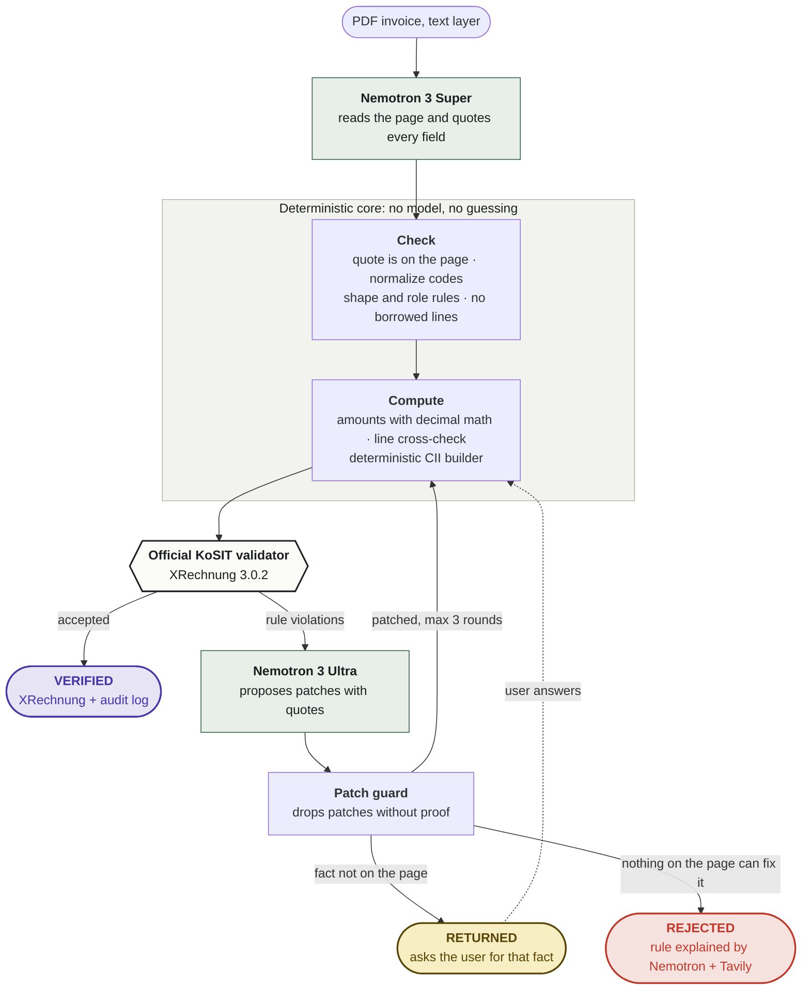

# Verdict

**PDF invoice in, valid German e-invoice (XRechnung) out. NVIDIA Nemotron proposes, the official KoSIT validator decides, and every value has to be on the page or computed.**

**Live demo:** https://verdict-678224659019.europe-west1.run.app  
Built for the **Nebius × NVIDIA Global AI Hackathon** (Best Apps and Agents). Runs on **Nebius Token Factory**.

---

## The problem

Germany is moving B2B invoicing from PDF to structured e-invoices (EN 16931). Every business has to be able to receive them since January 2025, and has to send them from 2027 or 2028 depending on size. Public-sector buyers already require XRechnung today. Most small businesses still produce PDFs.

The obvious shortcut is to let a language model read the PDF and write the XML. For an invoice, "probably correct" is not good enough: a model that guesses a missing IBAN, copies the buyer's city into the seller's address, or adds up a total itself produces a file that may even pass validation and still be wrong.

## What Verdict does

Drop a PDF. Every run ends in exactly one of three stamps:

| Stamp | Meaning |
|---|---|
| **Verified** | Every field is quoted from the page or computed. The official KoSIT validator accepted the XRechnung. Download it together with a verifiable audit log. |
| **Returned** | A fact the XRechnung needs is not on the document (for example the Leitweg-ID or the IBAN). Verdict asks for exactly that fact instead of inventing it, then validates again. |
| **Rejected** | The validator says no and nothing on the page can fix it. Verdict explains the rule in plain English and makes nothing up. |

The demo has a gallery of nine recorded runs on synthetic invoices that replay without spending model budget, plus live upload of your own text-based PDF.

## How it works




Every step is appended to a SHA-256 hash chain (RFC 8785 canonical JSON). Model events record the model ID, prompt hash, tokens and cost, never invoice contents. `pnpm audit:verify` detects any change to the log or the output file.

### NVIDIA Nemotron on Nebius Token Factory

| Step | Model | How it is used |
|---|---|---|
| Extraction | `nvidia/nemotron-3-super-120b-a12b` | JSON-schema constrained decoding, reasoning off, one quote per field and one row quote per line item |
| Repair | `nvidia/Nemotron-3-Ultra-550b-a55b` | Maps validator rule violations to evidence-backed JSON patches, or marks them as not solvable from the document |
| Explanations | `nvidia/nemotron-3-super-120b-a12b` | Explains a validator rule outside the local table in plain English, using Tavily search results as sources; cached per rule |

All calls go through one client that counts tokens, prices every call from pinned prices, and enforces a daily budget. A typical invoice costs about **0.3 to 0.4 US cents** in model calls and takes about **7 seconds**.

We tested the smaller `NVIDIA-Nemotron-3-Nano-30B-A3B` for explanations first. It confused the payee with the buyer, so explanations use Super.

## Benchmark

Ground truth comes from the public KoSIT XRechnung 3.0.2 test suite (19 invoices inside the MVP scope; synthetic data, placeholders filled with invented names and addresses). Each invoice is rendered as a PDF in several layouts; the corpus build is byte-reproducible and checked in CI.

- **clean:** three regular layouts
- **noisy:** shuffled blocks, plain number format, ISO dates
- **mutated:** 14 document-level defects (missing Leitweg-ID, IBAN, contact data, VAT IDs or electronic addresses, unit words instead of codes, € instead of EUR, wrong printed totals, VAT exemption without a reason, …) with the outcome a correct pipeline must reach
- **holdout:** four invoices kept out of all development until a single run on 2026-10-05

| Set | Documents | Valid XRechnung | Outcome as expected | Field accuracy | Invented fields |
|---|---|---|---|---|---|
| clean | 45 | 42 | 42 | 99.1 % | 7 |
| noisy | 30 | 25 | 25 | 99.1 % | 3 |
| mutated | 28 | 8 | 27 | 99.2 % | 5 |
| **holdout clean** | 12 | 8 | 8 | 98.0 % | 8 |
| **holdout noisy** | 8 | 6 | 6 | 96.7 % | 2 |

**How to read it**

- **No valid XRechnung with a wrong amount** in any set, holdout included: in every document Verdict output as valid, the grand total and amount due match the ground truth. This is the failure that matters most, because the validator cannot catch it.
- Documents that are not valid ended as **Returned**: Verdict asked for facts it could not find, mostly the seller contact block in the compact layout. A missed fact costs the user one question; it never becomes an invented value. In the mutated set, the expected outcome is often Returned or Rejected on purpose, so few documents end valid there.
- **Invented fields** counts values that are not in the ground truth at all, including in documents that were returned. Inside valid outputs only two kinds remain: the VAT exemption label kept as reason text next to its code (for category O the rule itself asks for the text "not subject to VAT"), and an account holder name equal to the seller name. They are counted, not hidden.
- The holdout rows are reported exactly as measured on commit `2555b8d`. The holdout showed field-level mistakes in three valid outputs (a scheme note left in an electronic address, a country code read as an address line); those and four more guards (VAT ID read as seller identifier, party name or e-mail address used as buyer reference, a country used as city, the other party's address block used during repair) were added afterwards and are measured on the development sets only. The holdout was not rerun.
- LLM output varies between runs; single documents flip between Verified and Returned from run to run. Full reports: [`docs/benchmark/`](docs/benchmark/).

Run it yourself: `pnpm eval --set clean|noisy|mutated --pipeline agent` (the holdout is locked behind `EVAL_ALLOW_HOLDOUT=1`).

## Scope and limits

- **Text-based PDFs only.** Token Factory offers no Nemotron vision model, so scanned invoices are refused with a clear message.
- Commercial invoices (type 380) in EUR, payment by SEPA credit transfer or none. No document-level allowances or charges, prepayments or rounding amounts.
- Output is XRechnung (UN/CEFACT CII). ZUGFeRD (PDF/A-3 with embedded XML) is planned.
- The demo is a demo: one instance, a per-IP rate limit and a daily model budget. When the budget is used up, the gallery keeps working.

## Privacy and security

- Nothing is stored. The PDF lives in memory for the duration of the request; results and the audit log go back to the browser.
- The validator runs in the same container on localhost only, protected by a per-boot secret.
- Secrets come from the environment (Secret Manager in production). gitleaks runs in CI and as a pre-commit hook.
- Test data is synthetic. No real invoices, no personal data.

## Repository

```
apps/web            Next.js app: upload, live run stream (SSE), routing slip, gallery
packages/core       semantic model (zod), evidence check, normalization, derivation,
                    CII builder, patch guard, agent loop, explanations, audit chain
services/verifier   Java 21 service around the KoSIT validator 1.6.3 (pinned, checksum-verified)
eval/               corpus builder, mutations, benchmark harness
deploy/             one-container image (app + validator) and the Cloud Run deploy script
docs/               PRD and SRS (German), benchmark reports
```

## Run it locally

Requirements: Node 22+, pnpm, Docker. No local Java needed; the validator builds in Docker.

```bash
cp .env.example .env          # add NEBIUS_API_KEY and a random VERIFIER_SECRET (16+ chars)
pnpm install
docker compose up -d --build verifier
pnpm testsuite:fetch          # pinned KoSIT XRechnung test suite, checksum-verified
pnpm verifier:check           # all CII suite instances valid, mutations rejected with rule IDs
pnpm --filter @verdict/web dev
```

Tests: `pnpm typecheck && pnpm test`. Deploy: `deploy/cloud-run.sh` (one Cloud Run service; see the script header).

## License

Apache License 2.0. Third-party components (KoSIT Validator, KoSIT XRechnung configuration and test suite) are used under their own licenses.
